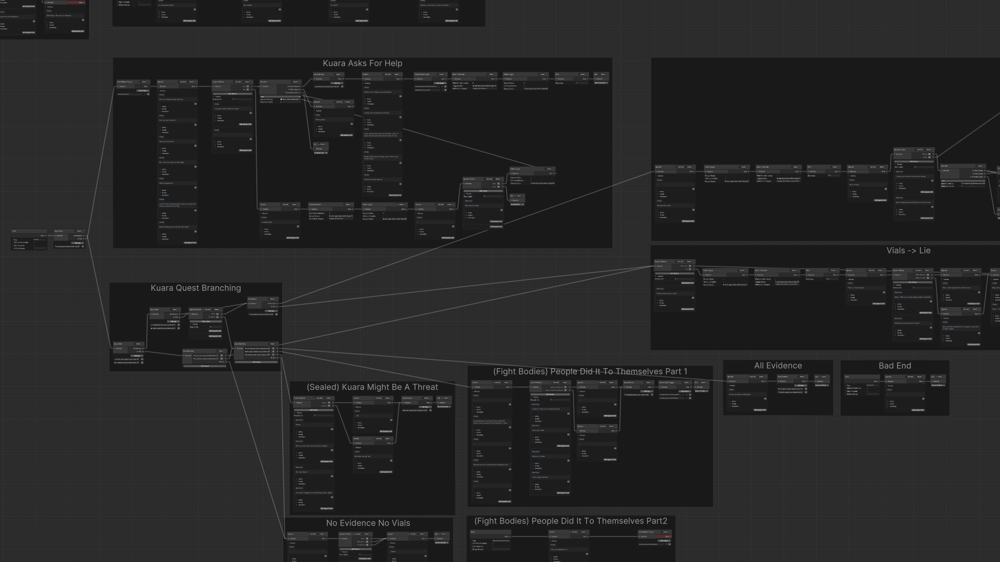

# About

Snippet code for an in Unity graph based quest editor. The runtime scripts facilitate runtime entry into the graph where each node represents an event that may block/control various actors and game elements. The primary goal of the graph is to enable ease of editing and visibility for dialogue and quest branching.

Starts from [`IncidentGraphEditorWindow`](./IncidentGraphEditorWindow.cs)

`.uss` styles are based off of: [@Wafflus](https://github.com/Wafflus/unity-dialogue-system)
